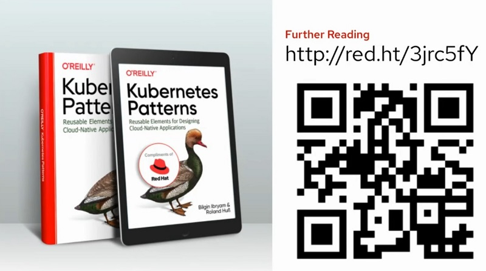

# Kubernetes Native Application Series

## Table of Contents
- [Best Practices for Developing Kubernetes Native Applications](practice.md)
  - a
  - b
  - c
- [Kubernetes Native Java for Spring Developer](quarkus.md)
  - First Quarkus
  - Developer Joy with Quarkus
  - Live Code Reload Local & Remote on OpenShift
  - JVM vs Native
  - Spring vs Quarkus JVM, Quarkus Native
  - Spring to Quarkus
- [Enhance your microservice app on Kubernetes with Event Driven Architecture](eda.md)
  - Micro service with Kafka & Quarkus
  - Change Data Capture (CDC) with AMQ Streams & Debezium
- [Secure Kubernetes Native Application by OpenID with Keycloak](keycloak.md)
  - Secure Web Application with Keycloak
  - 2FA with Keycloak (user/password & OTP)
  - Secure Micro Service with Keycloak
  - Control Security without change code (Use Keycloak Context-based (CBAC) Authorization)

