# Secure Kubernetes Native Application by OpenID with Keycloak
<!-- TOC -->

- [Secure Kubernetes Native Application by OpenID with Keycloak](#secure-kubernetes-native-application-by-openid-with-keycloak)
  - [Presentation](#presentation)
  - [Setup Demo](#setup-demo)
  - [Secure Web Application with Keycloak](#secure-web-application-with-keycloak)
  - [Test Secure Web Application with Keycloak](#test-secure-web-application-with-keycloak)
  - [2FA with Keycloak (user/password & OTP)](#2fa-with-keycloak-userpassword--otp)
  - [Secure Micro Service with Keycloak](#secure-micro-service-with-keycloak)

<!-- /TOC -->

## Presentation

Presentation ([keycloak.pptx](presentation/keycloak.pptx))

Demo Application

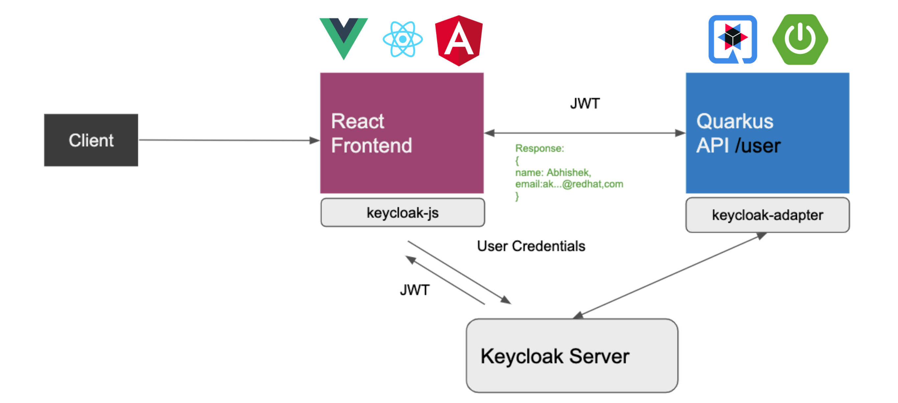

## Setup Demo

- get source code from devnation 
  - https://github.com/akoserwal/devnationtt-vue-keycloak
- start keycloak docker
```bash
docker run --name keycloak -e KEYCLOAK_USER=admin -e KEYCLOAK_PASSWORD=admin -p 8081:8080 -p 8543:8443 quay.io/keycloak/keycloak:11.0.2
```
- login to keycloak console url: http://127.0.0.1:8081/auth/
  
  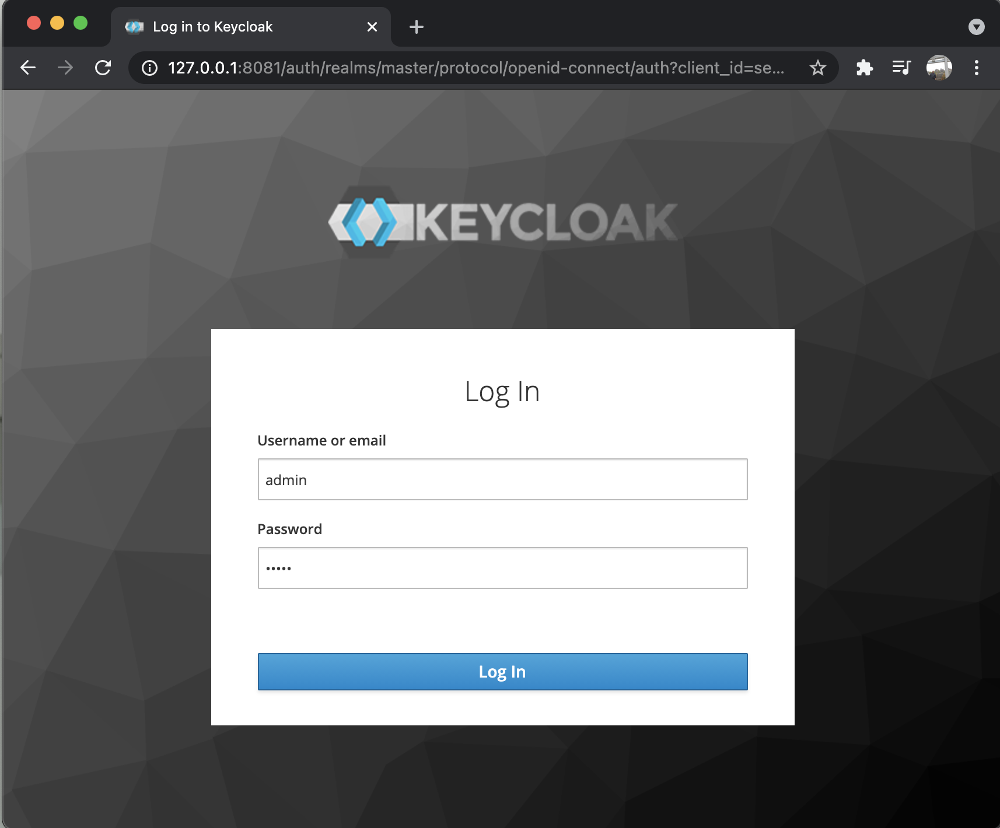
  
  user/password: admin/admin
- create realm: 'devnation'
- Create client: vue-app
  - client protocol: openid-connect 
  - access type: public
  - root url: http://127.0.0.1:8080
  - valid redirect uris: http://127.0.0.1:8080/*
  - admin url: http://127.0.0.1:8080
  - web origins: *
  
  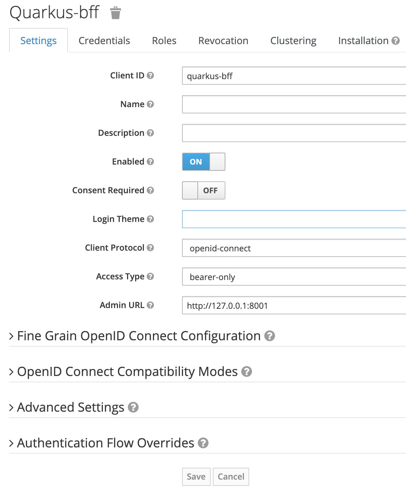
  
- Create client: quarkus-bff
  - client protocol: openid-connect 
  - access type: bearer-only
  - admin url: http://127.0.0.1:8001

  

- create user, username/password: demo-user/demo

## Secure Web Application with Keycloak

- open source code from devnationtt-vue-keycloak/vueapp-demo
- view src/main.js
  
  - import keycloak-js
  ```js
  import * as Keycloak from 'keycloak-js';
  ```
  
  - initOptions
  ```js
  let initOptions = {
    url: 'http://127.0.0.1:8081/auth', realm: 'devnation', clientId: 'vue-app', onLoad: 'login-required'
  }
  ```
- view App.vue 
  
  call backend service
  ```js
  mounted() {
    axios
    .get("http://127.0.0.1:8001/user", {
      headers: {
        Authorization: "Bearer " + this.keycloak.token
      }
    })
    .then(response => (this.user = response));
  }
  ```
  
- oepn soruce code from devnationtt-vue-keycloak/quarkus-bff
- view pom.xml, check dependency quarkus-keycloak-adapter
  
  ```xml
  <dependency>
    <groupId>io.quarkus.keycloak</groupId>
    <artifactId>quarkus-keycloak-adapter</artifactId>
    <version>1.0.0.Alpha1</version>
  </dependency>
  ```
- view application.properties
  
  ```
  # security configurations
  quarkus.oidc.client-id=quarkus-bff
  quarkus.oidc.auth-server-url=http://localhost:8081/auth/realms/devnation
  ```
- view UserResource.java --> @Authenticated

  ```java
  @Path("/user")
  @Authenticated
  @Produces(MediaType.APPLICATION_JSON)
  @Consumes(MediaType.APPLICATION_JSON)
  public class UserResource {
  ```

## Test Secure Web Application with Keycloak

- run vueapp-demo
  - go to source path devnationtt-vue-keycloak/vueapp-demo
  - run vue application with yarn
  ```bash
  yarn serve
  ```
  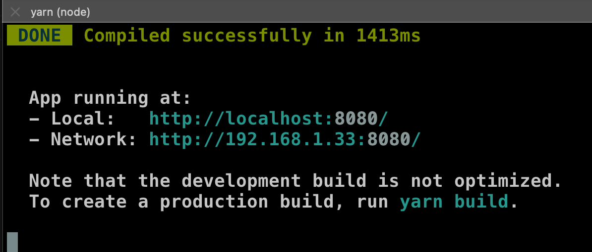

- run quarkus-bff
  - go to source path devnationtt-vue-keycloak/quarkus-bff
  - run quarkus with maven
  ```bash
  mvn quarkus:dev
  ```
  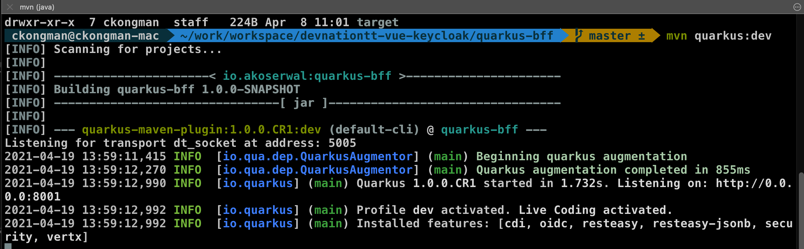
- Test Direct call Backend Service
  - call backend service with curl, show error 401 unauthorized
  ```bash
  curl -v GET http://127.0.0.1:8001/user
  ```
    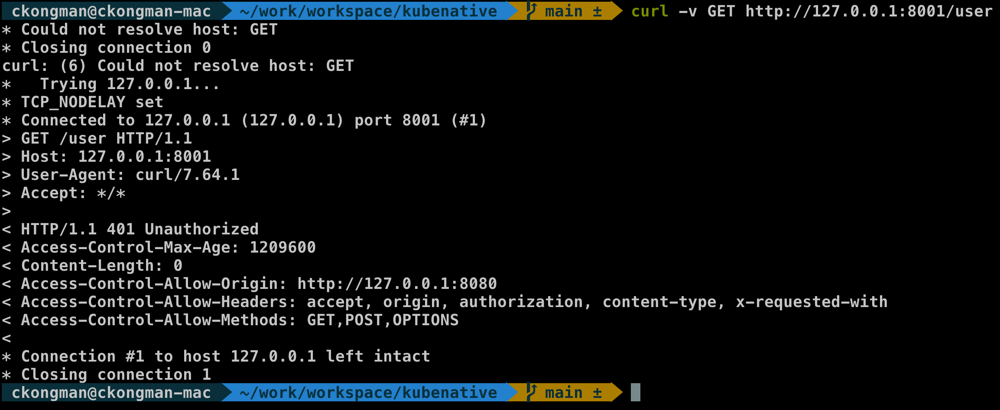
- open browser --> http://127.0.0.1:8080 --> redirect to keycloak "devnation"
  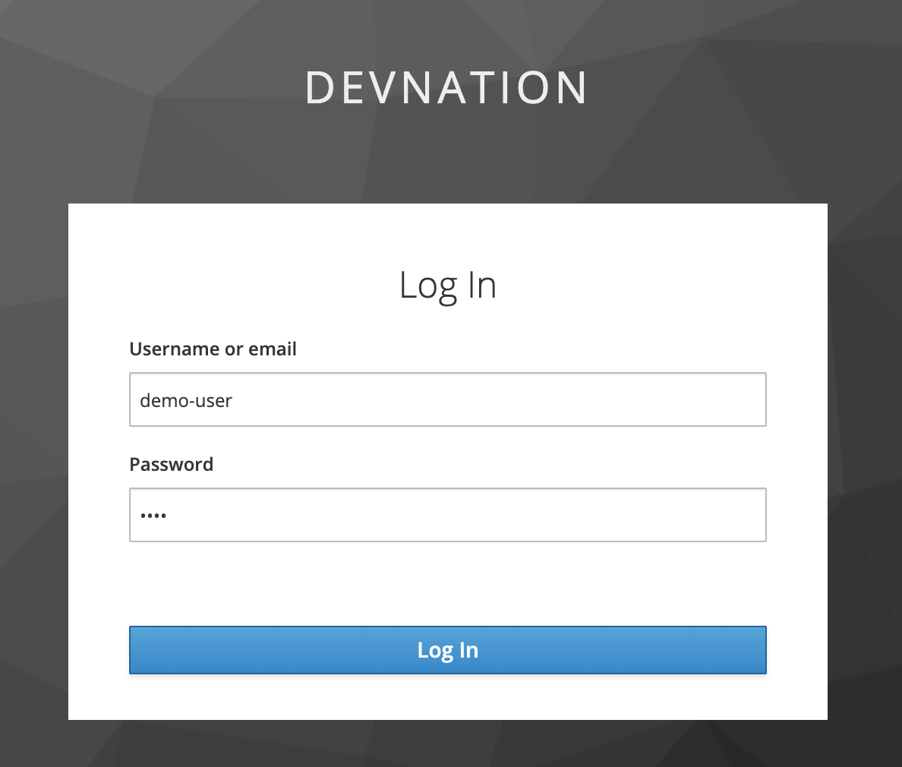
- login with demo-user/demo --> if success, it will show JWT and Response from Quarkus API, logout
    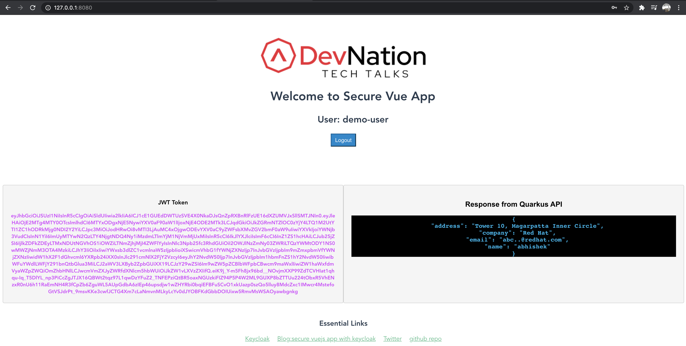
- Optional: test login with wrong user/password

## 2FA with Keycloak (user/password & OTP)

- Set Up OTP in Keycloak
  - login to keycloak admin console, realm: devnation
  - go to left menu Authentication --> tab required action --> enable check box Configure OTP as Default Action.(effect only new user)
  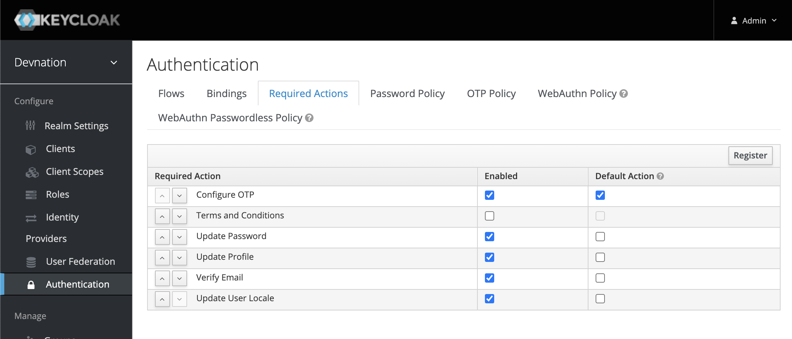
  - go to tab OTP Policy, show detail of OTP Policy (no action, show config only)
  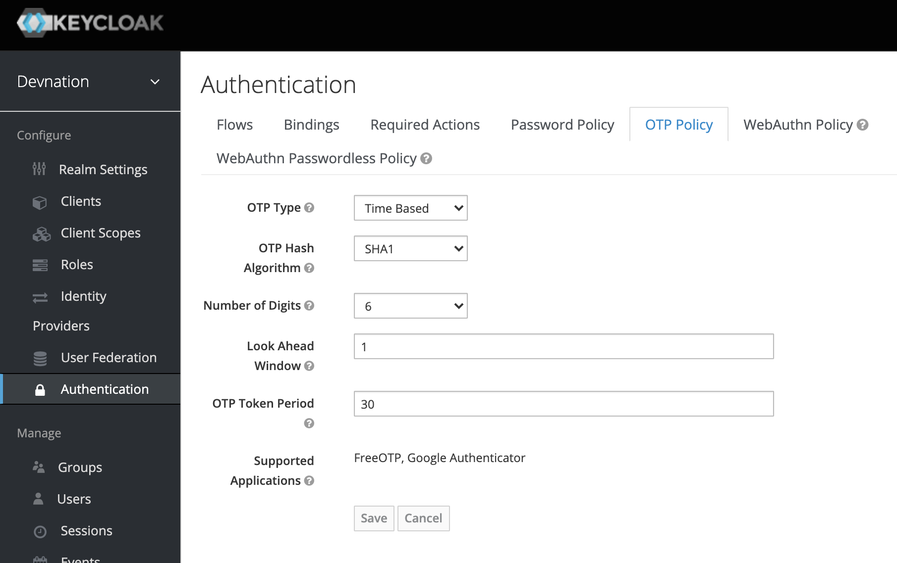
  - set existing user to config OTP, go to Left Menu Users, click demo-user, in details tab, add Configure OTP in Required User Action, save change
  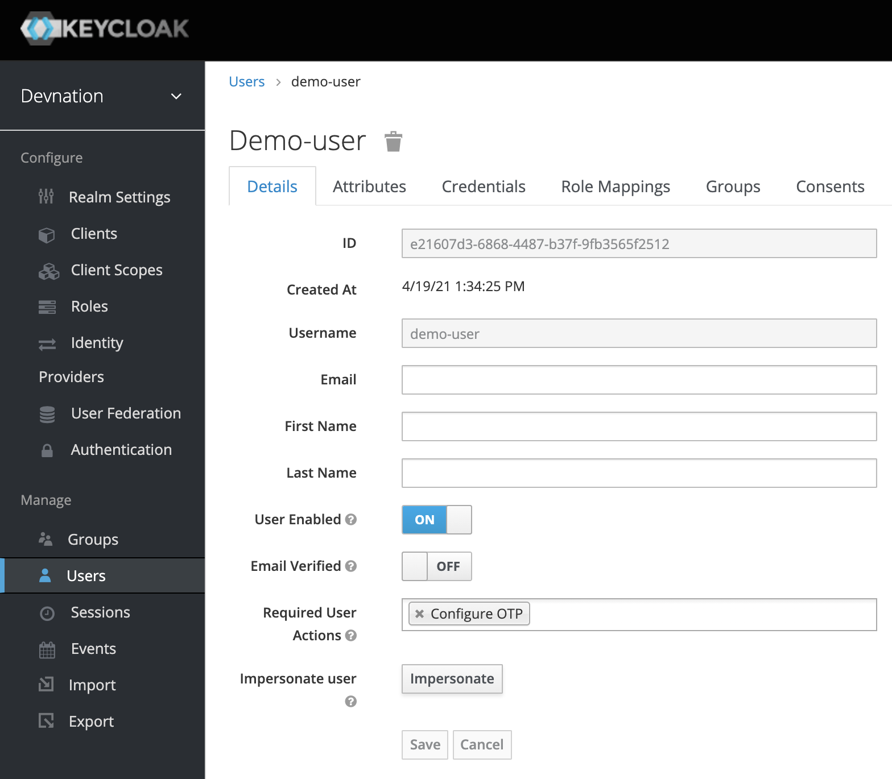
- Test OTP
  - Download & Install FreeOTP or Google Authenticator to your mobile
  - Open Browser to http://127.0.0.1:8080 again
  - login with demo-user/demo
  - web will re-direct to configure OTP page
  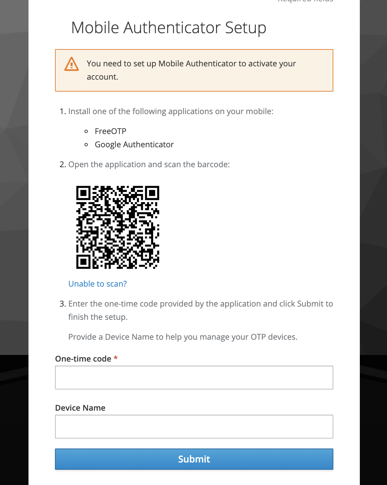
  - open FreeOTP/Google Authenticator, scan QR Code
  - get otp from mobile to one-time code text box, add device name such as 'my mobile'
  - submit, show vue-app page success login
  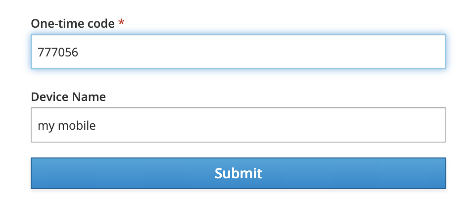
- logout and re-login again with otp
- stop demo
  - Ctrl-C bash yarn serve
  - Ctrl-C bash mvn quarkus:dev
  

## Secure Micro Service with Keycloak 
   Control Security without change code (Use Keycloak Context-based (CBAC) Authorization)

- use demo from https://quarkus.io/guides/security-keycloak-authorization
- use old docker keycloak from previous demo
  - import ([quarkus-realm.json](keycloak/quarkus-realm.json)) to keycloak
  - click add realm (top left menu, click on realm name), select ([quarkus-realm.json](keycloak/quarkus-realm.json)), save
    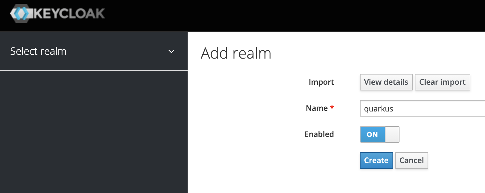
  - view detail of 'Quarkus' Realm
  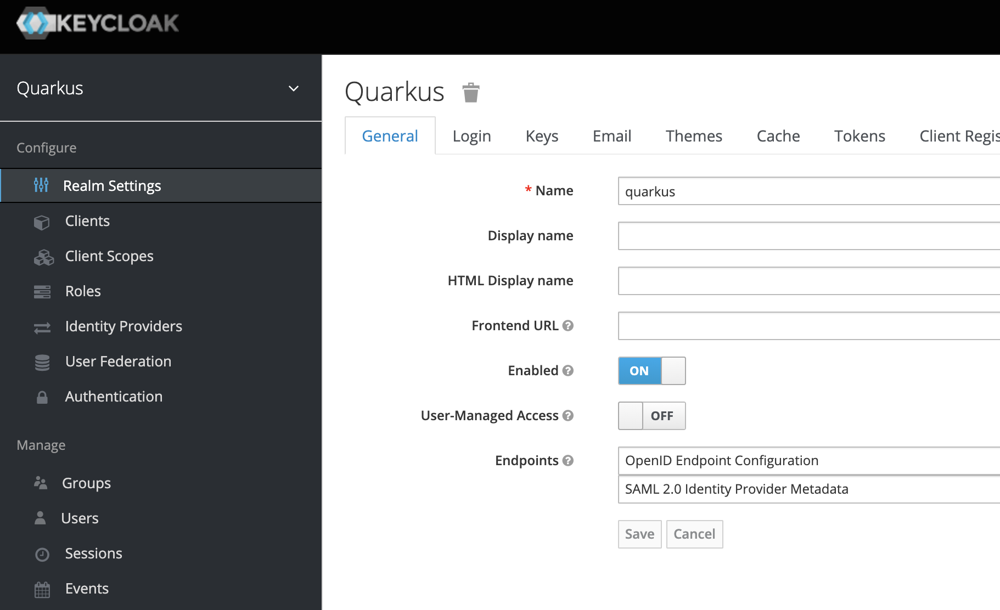
- Show Authorization Config (CBAC)
  - go to clients, Backend-service, authorization tab, sub resources tab, show user resource and admin resource
  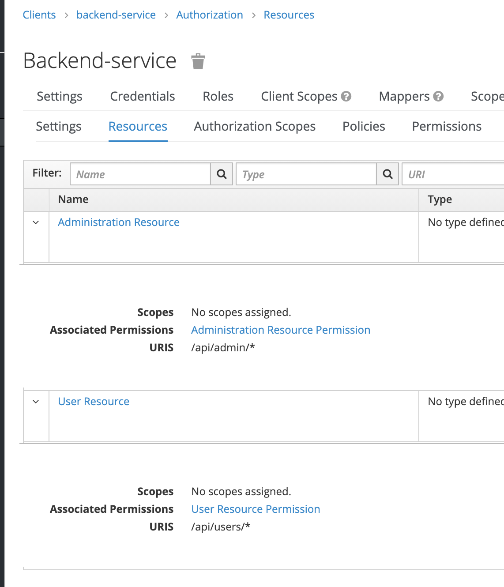
  - policies tab, show setup between resource and permission (map with role user and role admin)
  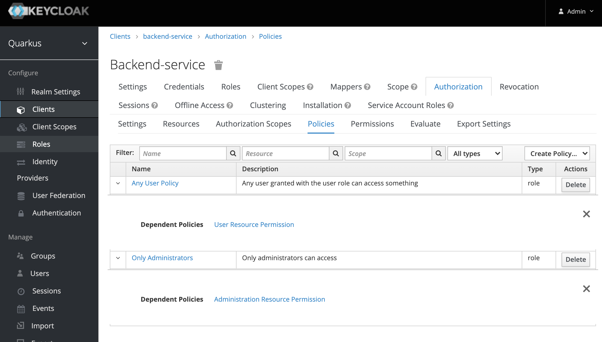


<!-- 

-->